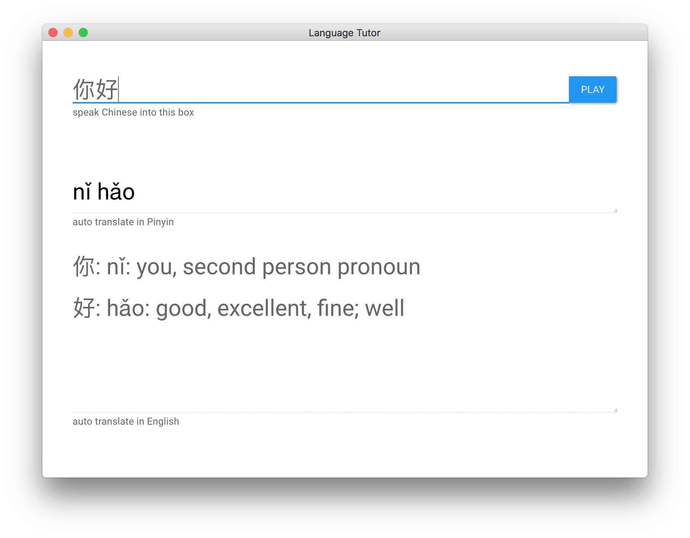

# Language tutor - draft 

_in active development_

Language tutor app to learn/test chinese pronunciation 

<!-- Used [Quick Start Guide](http://electron.atom.io/docs/tutorial/quick-start) as a starting point. -->




## Setup for STT 
- setup Chinese dictation is osx preferences.
- use double click `fn` twice to start dictation.

## Setup for TTS
- Download Chinese Mandarin `Ting-Ting`  text to speech language in osx.
- Enable Pinyin Chinese simplified keyboard in osx, with all caps as a switch between keyboard. 
- now you can type using chinese keyboard and Pinyin carachters. eg if you remember how a word is spelled in pinyin but not how to pronunce it in chinese, and want to hear the pronunciation by the tts before trying dictation.


## Development

```
npm install
```

```
npm start
```

## TODO: 

- [ ] if you type pinyin, perhaps in another window. then it translates to chinese char, translates to english definition. and then can run say.js on it.  
- [ ] speed control for speech playback, eg with slider? // not urgent


## Contributor 

- [Pietro](https://github.com/pietrop)